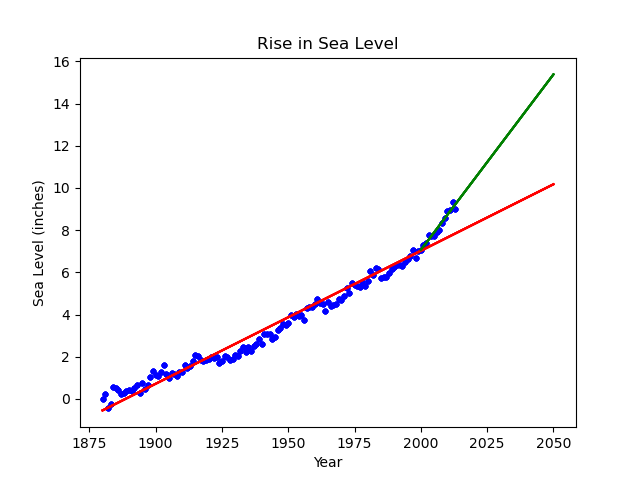

# Sea Level Predictor

This project is my solution to the FreeCodeCamp challenge **"Sea Level Predictor"**.  
The goal of the challenge is to analyze historical sea level data and create a prediction model.

## Explanation

The program loads sea level data from a CSV file and uses linear regression to model the trend of rising sea levels.  

- A scatter plot shows the original data points (years vs. sea level in inches).  
- A line of best fit is drawn across all the data to highlight the overall trend.  
- A second line of best fit is created using only the data from the year 2000 onward to show the more recent trend.  
- Both regression lines are extended until the year **2050** in order to predict future sea level rise.  

The graph clearly illustrates how the sea level has risen over time and provides a projection for future years.

## Files

- `sea_level_predictor.py`: The Python script that loads the data, performs the analysis, and generates the plot.  
- `epa-sea-level.csv`: The dataset provided by FreeCodeCamp containing sea level measurements.

## Output

Running the script generates a plot showing:  
1. The raw data points (scatter plot).  
2. A linear regression line using all available data.  
3. A linear regression line using only data from 2000 onward.  
4. Both regression lines extended until **2050**.  

This visualization provides an estimate of future sea levels based on past trends.
